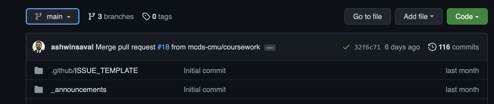
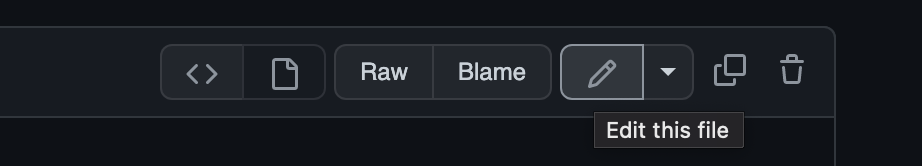
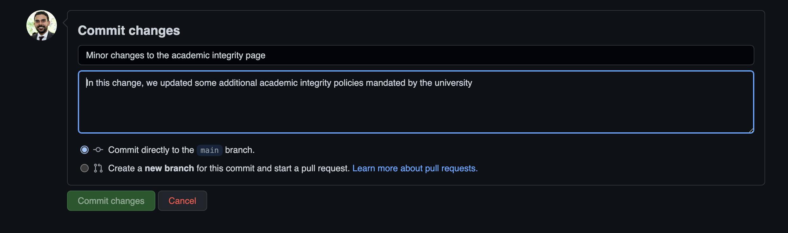
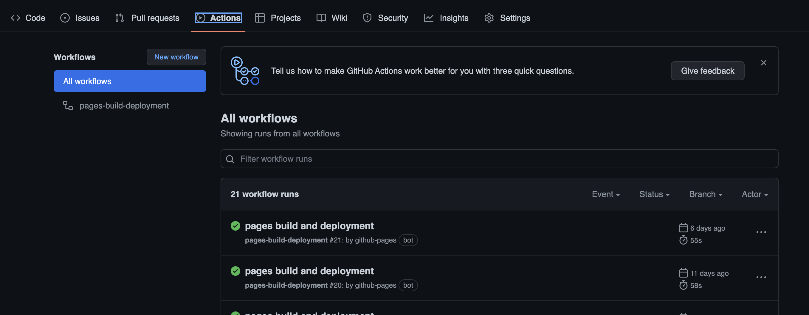
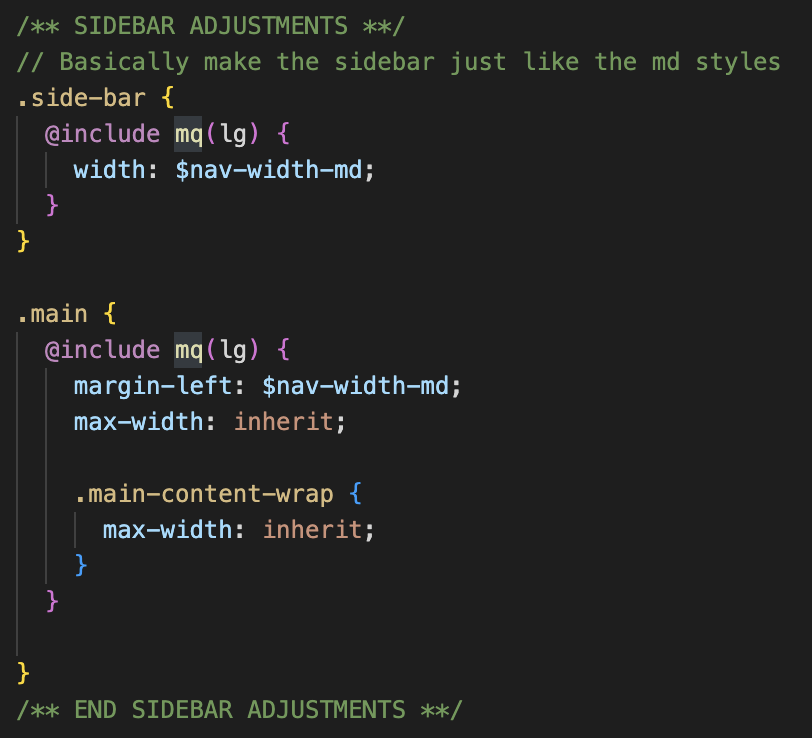
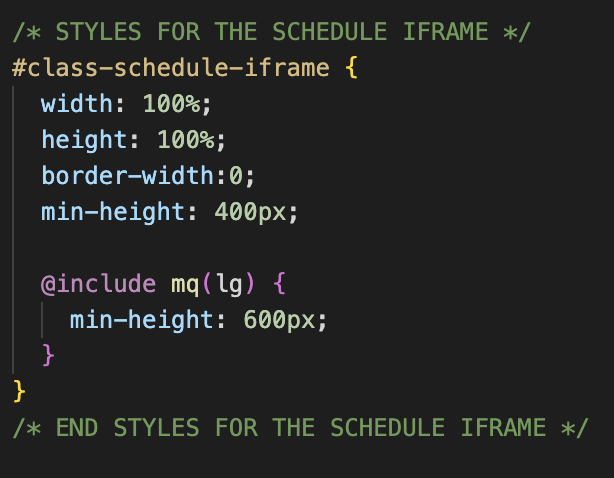
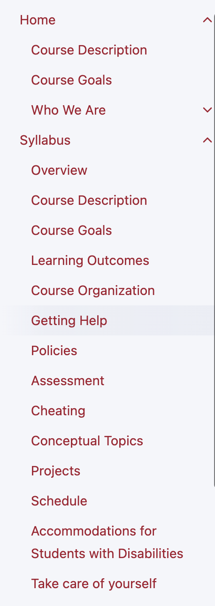
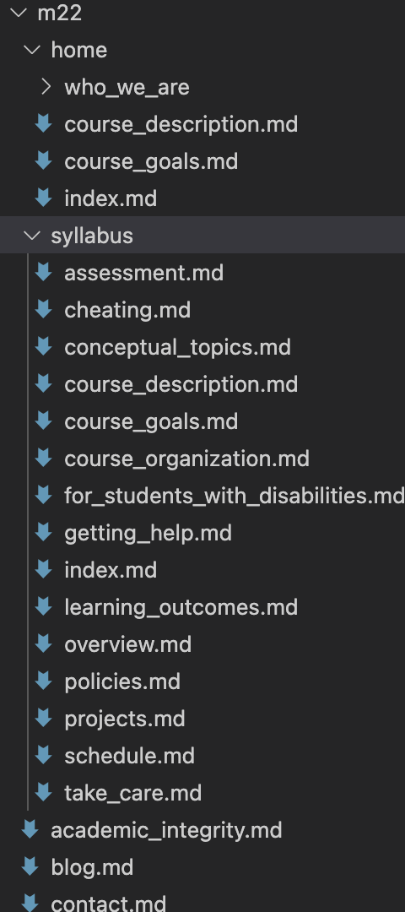

# For Non-Developers (only for minor changes)

This website uses `kramdown` which is a variant of `markdown`. All pages with a `.md` extension are processed into HTML by Github.

In order to make changes, here are the steps:

## 1. Ensure that you are on the `main` branch



## 2. Navigate to any file you want to edit, and click on the `edit-file` icon



## 3. Once you are done with your changes, make sure to include a description of changes and press `commit changes`



## 4. You're done. The Changes will reflect on the website within a few minutes

You can track when the changes will be published by going to the `Actions` tab and monitoring the build.



# For Developers

This website is heavily adapted from [Just the Class](https://kevinl.info/just-the-class/) ([Github Repo Here](https://github.com/kevinlin1/just-the-class)). We forked [Just the Class](https://kevinl.info/just-the-class/), and made modifications to suit the MCDS theme.

[Just the Class](https://kevinl.info/just-the-class/) itself uses the [Just the Docs](https://just-the-docs.github.io/just-the-docs/) template.

## What does this mean for development?

[Just the Docs](https://just-the-docs.github.io/just-the-docs/) is the primary template you should be referring to. In the interest of maintainability, much of the implementation is as idiomatic as possible with the [Just the Docs](https://just-the-docs.github.io/just-the-docs/) template.

Additionally, [Just the Docs](https://just-the-docs.github.io/just-the-docs/) provides enough examples to help you implement pages, custom images, stylings as well as SEO.

HINT: A good idea is to clone the [Just the Docs](https://github.com/just-the-docs/just-the-docs) and [Just the Class](https://github.com/kevinlin1/just-the-class) repositories on your local machine. If you are confused about how to do something idiomatically, these repositories can be a good reference.

## Customizations
### 1. The Sidebar is the same size on all desktop views (`custom.scss`):


### 2. All styling for the Google Calendar iFrame on `Calendar` (`custom.scss`)


### 3. The Anchor Links on the Home and Syllabus Page is a custom implementation of [Just the Docs Navigation Structure](https://just-the-docs.github.io/just-the-docs/docs/navigation-structure/)


[Just the Docs Navigation Structure](https://just-the-docs.github.io/just-the-docs/docs/navigation-structure/) allows for pages and sub-pages to be displayed correcly in the navigation structure.

**However, Just the Docs does not have this capability for anchor links within the same page**. In order to support this functionality in the most idiomatic way possible, we created sub-pages for the Home and Syllabus page, and we added a new field called `anchor_url` to the [Jekyll frontmatter](https://jekyllrb.com/docs/front-matter/).

This is why you will see a long list of empty files under the syllabus (and home) folder, just for anchor links.



## Local development environment

This site requires no special Jekyll plugins and can run on GitHub Pages' standard Jekyll compiler. To setup a local development environment, clone this repository and follow the GitHub Docs on [Testing your GitHub Pages site locally with Jekyll](https://docs.github.com/en/pages/setting-up-a-github-pages-site-with-jekyll/testing-your-github-pages-site-locally-with-jekyll).

You should be able to run the site with the following commands:<br />
```bundle install``` (First time only)<br />
```bundle exec jekyll serve```

## Migrating Course Pages for Fall and Summer each year

There is a seperate document for migrating course pages based on seasons. You can find that guide [in the README-CourseMigration page](README-CourseMigration)